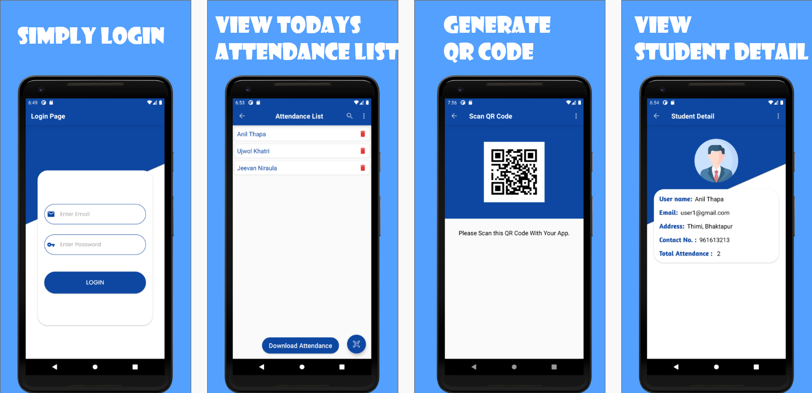

# QrAttendanceAppDemo
This is our 3rd Year Project on a Simple QrAttendance System.

***Download latest apk from below 👇***

[](https://drive.google.com/drive/folders/17PiuxNucwcX-5emvQBt7cK2FWaVdLwWk?usp=sharing)

## Developed By
- Anil Thapa
- Jeevan Niraula
- Ujjwol Khatri


## Built With 🛠
- [Kotlin](https://kotlinlang.org/) - First class and official programming language for Android development.
- [Navigation Component](https://developer.android.com/guide/navigation) -Navigation refers to the interactions that allow users to navigate across, into, and back out from the different pieces of content within your app.
- [View Binding](https://developer.android.com/topic/libraries/view-binding) View binding is a feature that allows you to more easily write code that interacts with views. 
- [Firebase Firestore](https://firebase.google.com/docs/firestore):Cloud Firestore is a flexible, scalable database for mobile, web, and server development from Firebase and Google Cloud.
- [Firebase Authentication](https://firebase.google.com/docs/auth):Firebase Authentication provides backend services, easy-to-use SDKs, and ready-made UI libraries to authenticate users to your app.
- [Zxing QR Generator](https://github.com/zxing/zxing/wiki/Getting-Started-Developing): Zxing is a public library used to generate QR Code in our Project.
- [Apache POI](https://poi.apache.org/) :We used Apache POI library to download our attendance list to an Excel File.


## Package Structure
```
 --com.gameonanil.my.instagramcloneapp
   |-- adapter             (has all the recycler adapter)
   |-- models              (has all the data class)
   |-- ui                  (All Activity and Fragment)
     |-- login              (Has Login Activity)
        |-- LoginActivity
        |-- ForgetPasswordActivity
     |-- admin  
        |-- MainAdminFragment
        |-- AddTeacherFragment
        |-- AddStudentFragment
        |-- ManageUserFragment
        |-- UserDetailFragment      
     |-- student            (Has Student Activity)
        |-- StudentActivity
        |-- EditStudentDetailActivity
     |-- teacher            (Has Teacher Activity and Fragment)
        |-- ChooseSubjectFragment    
        |-- MainAttendanceFragment  
        |-- FindAttendanceFragment    
        |-- NewAttendanceFragment  
        |-- GenerateQRFragment    
        |-- StudentDetailsFragment  

```
